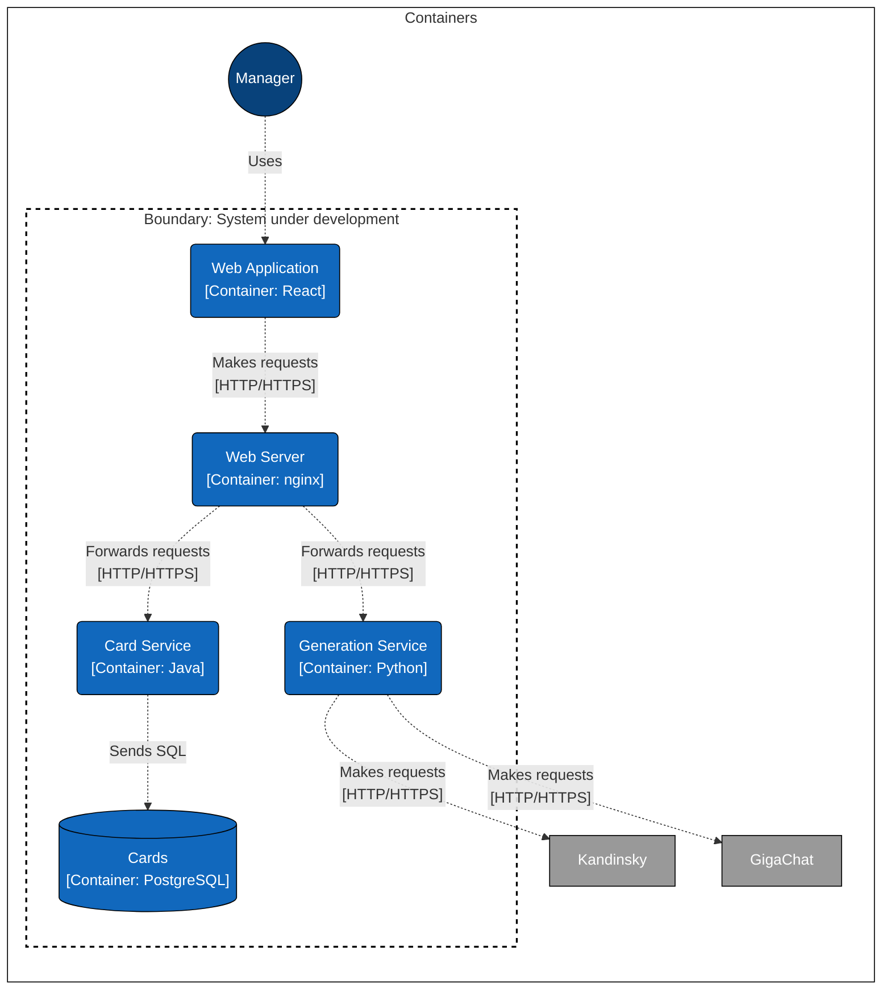

# Сервис продуктовых карточек

## Назначение репозитория
Данный репозиторий содержит следующую информацию:
- текущая архитектура сервиса в целом
- соглашение о контракте взаимодействия (API)
- схема развертывания Docker Compose

## Архитектура сервиса (C4 Containers)

## Контракт взаимодействия между фронтендом и бэкендом
В контракте используются следующие теги:
- card - соответствует API для сервиса карточек
- ai - соответствует API для сервиса генерации контента

Подробнее о контракте можно почитать в файле api.yaml или посмотреть в Swagger по 
[ссылке](https://kortkamp.github.io/swagger-viewer/?host=https%3A%2F%2Fraw.githubusercontent.com%2FProductCardService%2FProductCardService%2Fmaster%2Fapi.yaml)

## Демонстрация приложения


## Команды для запуска
Собрать все Docker Image
```bash
docker build -t product-card-service/web:latest .
docker build -t product-card-service/card-service:latest .
docker build -t product-card-service/ai-service:latest .
```
Запустить всё одной командой
```bash
docker compose up
```

